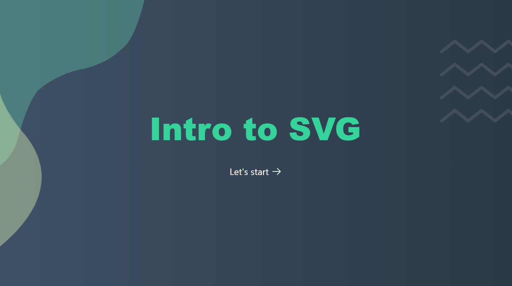

This repository contains slides accompanying an internal lunch & learn session in Thoughtworks on Intro to SVG, that happened on 12 November 2021.

Slides are built with [Slidev](https://github.com/slidevjs/slidev), with the [Penguin](https://github.com/alvarosaburido/slidev-theme-penguin) theme which I have slightly modified.

[An article has been published](https://esteetey.dev/introduction-to-svg) to incorporate feedback from the session and for more people to learn about SVG.

---

## SVG Element Basics Cheatsheet

You can click on the result image to go to the SVG file directly!

| Shape     | Usage Example                                                                                                | Result                                                                                                         |
| --------- | ------------------------------------------------------------------------------------------------------------ | -------------------------------------------------------------------------------------------------------------- |
| Square    | `<rect x="50%" y="50%" width="40" height="40" fill='#abcbca' />`                                             |     |
| Rectangle | `<rect x="50%" y="50%" width="80" height="40" fill='#abcbca' />`                                             |  |
| Circle    | `<circle cx="50%" cy="50%" r="60" fill="#abcbca" />`                                                         |     |
| Ellipse   | `<ellipse cx="100" cy="50" rx="80" ry="40" fill='#abcbca' />`                                                |    |
| Polygon   | `<polygon points="100,10 40,198 190,78 10,78 160,198"  fill='#abcbca' stroke='#123123' stroke-width='5'  />` |    |
| Polyline  | `<polyline points="100,10 40,198 190,78 10,78 160,198" fill='#abcbca' stroke='#123123' stroke-width='5' />`  |   |

Thanks Matej & Chee Aun for their help and tips to render this correctly.

---

## Topics for you to explore more

- More complex SVG elements such as patterns, filters, paths
- Accessibility of SVGs
- Performance of SVGs

---

## More Resources

- [MDN Web Docs on SVG](https://developer.mozilla.org/en-US/docs/Web/SVG)
- [CSS Tricks - how to scale SVG](https://css-tricks.com/scale-svg/)
- [Smashing Magazine - SVG Generators](https://www.smashingmagazine.com/2021/03/svg-generators/)
- [Frontend Masters - SVG Essentials & Animations v2](https://frontendmasters.com/courses/svg-essentials-animation/?utm_source=css-tricks&utm_medium=website&utm_campaign=css-tricks-tags-sidebar)

---